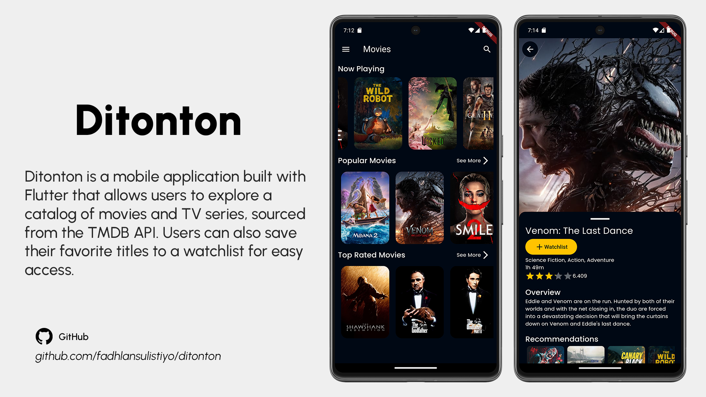
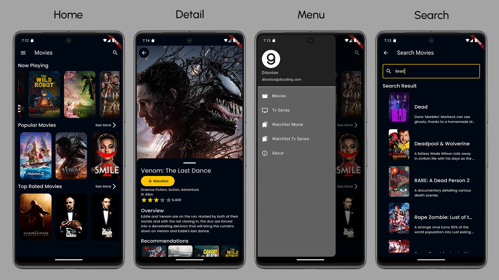
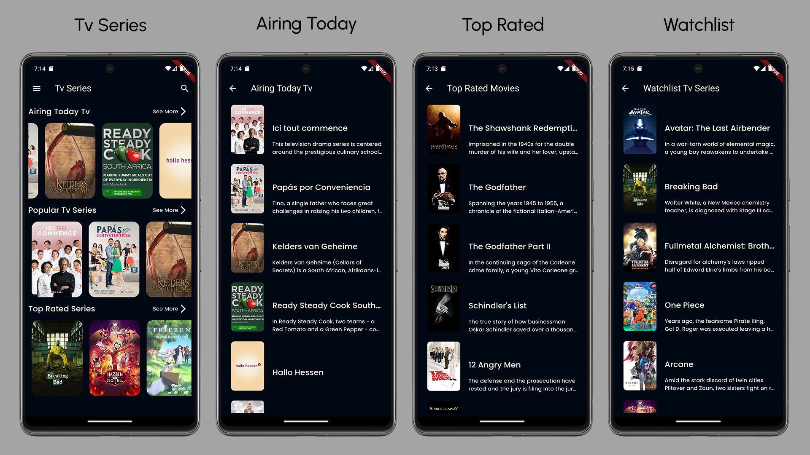

# Ditonton

Ditonton is a mobile application built with Flutter that allows users to explore a catalog of movies and TV series, sourced from the TMDB API. Users can also save their favorite titles to a watchlist for easy access. The app provides a seamless browsing experience for movie enthusiasts.

## Features

- **Displays Movie and TV Series Catalog**: Browse through a rich catalog of movies and TV series sourced from the TMDB API.
- **Save to Watchlist**: Users can save their favorite movies and TV shows to a personalized watchlist for future reference.
- **Search for Movies and TV Series**: Users can search for specific movies or TV series by title, genre, or year, making it easy to find their favorites or explore new ones.
- **See Movie Recommendations**: Based on the movies and TV shows users like or have watched, Ditonton suggests related titles to enhance the browsing experience and help discover new content.

## Tech Stack

- **Clean Architecture**: The app follows the clean architecture pattern to separate concerns and ensure scalability and maintainability.
- **TTD (Test-Driven Development)**: Focuses on writing tests before implementation to ensure the app is reliable and bug-free.
- **Bloc**: A reactive programming library for managing the app's state in a predictable way using streams and events.
- **RxDart**: Enhances Flutter's built-in stream support with more operators and functionality for reactive programming.
- **CI with CodeMagic**: Continuous integration and delivery are set up using CodeMagic to automate builds and testing.
- **SSL Pinning**: Ensures secure communication with the backend by pinning the SSL certificate to prevent man-in-the-middle attacks.
- **Firebase Crashlytics**: Real-time crash reporting to help track and fix bugs.
- **http**: For making network requests to fetch data from the TMDB API.
- **Injection with get_it**: Dependency injection using the `get_it` package for managing app services and state.
- **sqflite**: A local SQLite database for storing user data, such as the watchlist.

## Build Setup

This project uses the following build tools and dependencies:

- **Android Build Version**: `com.android.application` version `8.3.2`
- **Gradle**: Version `8.4`
- **Android Studio**: Ladybug (Version `2024.2.1`)

### Code Generation

This project may require code generation for certain features. To regenerate the necessary files, run the following command in your terminal:

`flutter pub run build_runner build`

## API Integration

The app fetches movie and TV series data from the [TMDB API](https://www.themoviedb.org/documentation/api). Ensure that you have a valid API key and configure it in the app's environment before using the app.

## Screenshots

## Acknowledgements

- **Dicoding Indonesia**: Special thanks to [Dicoding Indonesia](https://www.dicoding.com/academies/199) for their awesome **Flutter Expert** class, which provided the knowledge and skills necessary to develop this project. Their comprehensive curriculum helped improve my understanding of Flutter development, clean architecture, and modern mobile app practices.
